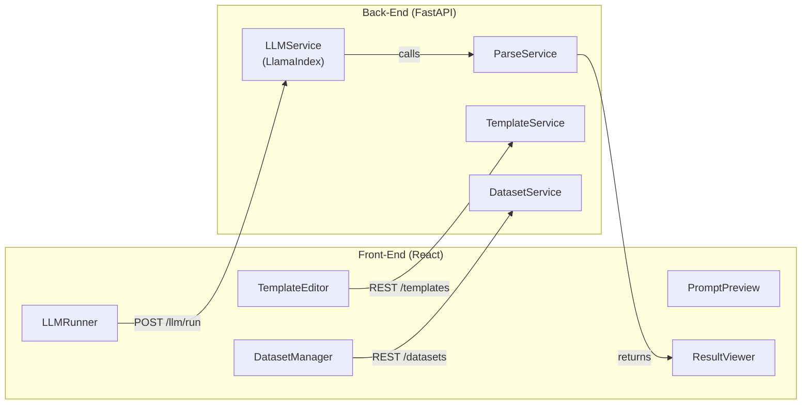

# Template-Explorer: Design & Implementation Plan

## 1️⃣ Overview
An interactive playground for experimenting with large-language-model (LLM) prompt templates.
Users can:
1. Author / edit prompt templates with placeholders (e.g. `{{title}}`, `{{body}}`).
2. Load JSON / JSONL datasets and map fields to placeholders.
3. Execute the template against an LLM (single record or batch) via server-side FastAPI + LlamaIndex.
4. (Optionally) define a parsing rule (structured output spec or Python snippet) to post-process the LLM response.
5. Persist results back to disk — either as a new file or appended as an extra field to the original dataset.
6. Save / load templates & datasets for later reuse.

Tech stack: **Vite + React + TypeScript + Tailwind + Monaco Editor** (front-end) and **FastAPI + LlamaIndex** (back-end).


---

## 2️⃣ Problem Statement
Prompt engineering is iterative. Analysts need a lightweight tool to iterate over templates, test on sample/batch data, inspect responses, and measure quality without writing glue scripts each time.


---

## 3️⃣ User Stories
* **US-01 – Edit Template**: As a user, I can write or edit a Jinja-like template with placeholders.
* **US-02 – Load Dataset**: I can load one or more JSON / JSONL files; for JSONL I can select a single record or run batch mode.
* **US-03 – Run Single Prompt**: I can preview generated prompt for one record and send it to the LLM.
* **US-04 – Batch Execution**: I can run the template over an entire JSONL file and download results.
* **US-05 – Parse Output**: I can choose a parser: Raw, Structured (Pydantic model), or Custom Python.
* **US-06 – Augment Dataset**: I can merge LLM outputs into the source file as a new field and save.
* **US-07 – Save/Load Session**: I can persist templates and datasets to reuse later.
* **US-08 – Multi-Source Templates**: I can attach multiple datasets (record-level and global) to a template and map their fields or specific rows to placeholders.

---

## 4️⃣ Functional Requirements
1. **Template CRUD**: Create, list, update, delete templates.
2. **Dataset CRUD**: Upload, list, download datasets.
3. **Multi-Dataset Binding**: Allow a template to reference several data sources, designating each as **record-scoped** (changes per iteration) or **global-scoped** (constant for the whole batch or chosen row).
4. **LLM Invocation**: Endpoint that receives `{template_id | text, datasource_bindings, parser}` and returns parsed result(s).
5. **Parsing**: Support three parser modes.
6. **Persistence**: Ability to write augmented dataset back to storage.
7. **Configurable LLM**: Allow selecting provider and model + parameters (temperature).


---

## 5️⃣ Architecture


### Data Flow (single run)
1. Front-end sends `POST /llm/run` with `{template_id | template_text, datasource_bindings, parser_spec}`.
   * `datasource_bindings` is an array where each entry specifies `source_id`, `scope` (`record` | `global`), and, for `global`, an optional `row_index` or query.
2. `LLMService` fills placeholders, calls LlamaIndex.
3. Output is piped through `ParseService`.
4. Parsed result returned to FE and rendered in `ResultViewer`.

---

## 6️⃣ API Specification (v0)
| Method | Path | Request | Response | Notes |
|--------|------|---------|----------|-------|
| GET    | /templates             | –                     | List<TemplateMeta> | No pagination |
| POST   | /templates             | TemplateCreate        | TemplateMeta       | upload or inline |
| GET    | /templates/{id}        | –                     | Template           | includes content |
| PUT    | /templates/{id}        | TemplateUpdate        | Template           | |
| DELETE | /templates/{id}        | –                     | 204                | |
| GET    | /datasets              | –                     | List<DatasetMeta>  | |
| POST   | /datasets              | multipart/form-data   | DatasetMeta        | upload file |
| GET    | /datasets/{id}/{index} | -                     | JSON object        | preview record |
| POST   | /llm/run               | RunRequest            | RunResponse        | single |
| POST   | /llm/batch             | BatchRunRequest       | BatchRunResponse   | async – returns job id |
| GET    | /jobs/{id}/status      | –                     | JobStatus          | polling |
| GET    | /jobs/{id}/result      | –                     | JobResult          | polling |

Schema excerpts (pydantic):
```python
class RunRequest(BaseModel):
    template_id: str | None
    template_text: str | None  # one of the two
    datasource_bindings: list[DataSourceBinding]  # see below
    parser: ParserSpec | None
    llm: LLMConfig | None      # model name, temp, max_tokens, etc.

class DataSourceBinding(BaseModel):
    source_id: str            # dataset id
    scope: Literal["record", "global"]
    row: int | None           # required if scope=="global" and jsonl
```

---

## 7️⃣ Front-End Design
* **Visual Design**: see `design_mock_5.html`
* **State Management**: React Query + Zustand (simple global store)
* **Routing**: `/` dashboard, `/template/:id`, `/dataset/:id`, `/playground`
* **Key Components**
  * `TemplateEditor` – Monaco editor with Jinja syntax-highlight.
  * `DatasetView` – list of records (shown as trees) for JSONL (100s of records).
  * `DatasourceBinder` – UI to attach multiple datasets to a template, choose scope (`record`/`global`) and (for global JSONL) select specific row.
  * `PromptPreview` – shows filled prompt.
  * `RunnerPanel` – model params, parser selector, run buttons.
  * `ResultViewer` – tabbed: raw, parsed object.

Tailwind used for layout; DaisyUI for primitives.

Front-end should be built with reusable components using a common design system.


---

## 8️⃣ Parsing Strategies
1. **Raw** – Return text as-is.
2. **Structured** – Use LlamaIndex `structured_predict` with a user-defined Pydantic model.
3. **Custom Python** – User supplies a function `def parse(text: str) -> Any`. Executed without any sandbox for now.

---

## 9️⃣ Data Storage
* Filesystem under `template-explorer/storage/` by default:
  * `templates/*.jinja`
  * `datasets/{name}.jsonl`, or `datasets/{name}.json`
  * `results/{result_name}.jsonl` for batch results

---

## 🔟 Implementation Roadmap
| Phase | Milestone | Key Tasks | Done |
|-------|-----------|-----------|-------|
| 0 | Repo scaffolding | `uv pip install` deps; create FE/BE skeleton| ✅ |
| 1 | Template CRUD    | Pydantic models, FS storage, REST, FE editor | ✅ |
| 2 | UI visual design | Apply visual design from `design_mock_5.html` to FE | ✅ |
| 3 | Dataset CRUD     | Upload endpoint, sample preview, FE table | ✅ |
| 4 | Data binding     | FE DatasourceBinder, select datasets and rows | ✅ |
| 5 | Template render  | FE TemplateEditor, Jinja syntax highlighting, template preview | ✅ |
| 6 | Single-Run MVP   | Integrate LlamaIndex `llm_predictor`, implement `/llm/run`, FE RunnerPanel & viewer | ✅ |
| 7 | Batch Runner     | fastapi-background-tasks, progress API, result download | ✅ |
| 8 | Parsing Modes    | Structured parser + custom python | ✅ |
| 9 | Persistence      | Merge back to dataset, overwrite / new file | ✅ |

